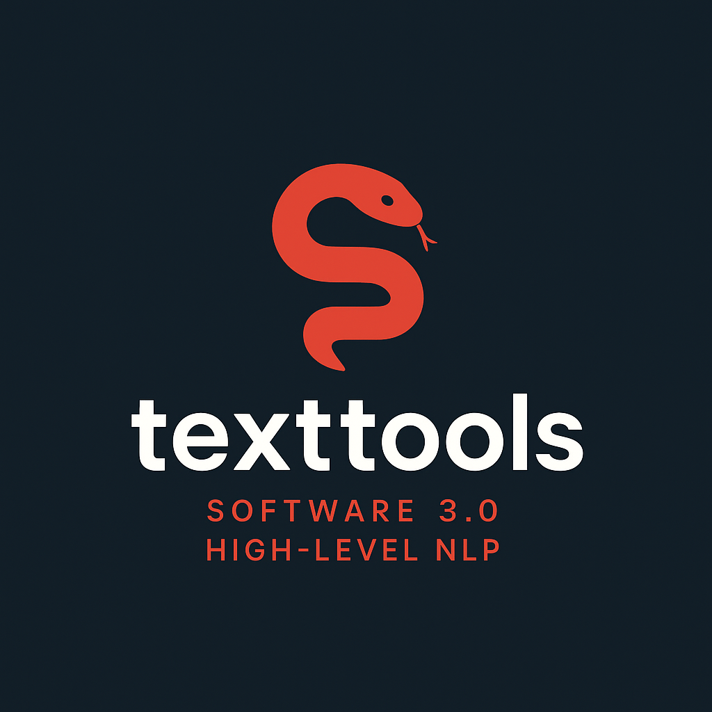

# Text Tools

<p align="center">
  
</p>


<p align="center">
  
</p>

---

## 📌 Overview

**TextTools** is a high-level **NLP toolkit** built on top of modern **LLMs**.  
It provides ready-to-use utilities for **translation, question detection, keyword extraction, categorization, NER, and more** — designed to help you integrate AI-powered text processing into your applications with minimal effort.

Forget boilerplate and low-level utilities — TextTools makes advanced LLM workflows feel like calling a simple Python function.

---

## ✨ Features

TextTools provides a rich collection of high-level NLP utilities built on top of LLMs.  
Each tool is designed to work out-of-the-box with structured outputs (JSON / Pydantic).

- **Categorizer** → Zero-finetuning text categorization for fast, scalable classification.  
- **Keyword Extractor** → Identify the most important keywords in a text.  
- **Merger** → Merge the provided questions, preserving all the main points 
- **NER (Named Entity Recognition)** → Extract people, places, organizations, and other entities.  
- **Question Detector** → Determine whether a text is a question or not.  
- **Question Generator** → Generate high-quality, context-relevant questions.
- **Rewriter** → Rewrite text while preserving meaning or without it.
- **Summarizer** → Condense long passages into clear, structured summaries. 
- **Translator** → Translate text across multiple languages, with support for custom rules.


---

## 🚀 Installation

Install the latest release via PyPI:

```bash
pip install -U hamta-texttools
```

---

## ⚡ Quick Start

```python
from openai import OpenAI

from texttools import QuestionDetector, Translator

# Create your OpenAI client
client = OpenAI(base_url = "your_url", API_KEY = "your_api_key")

# Specify the model
model = "gpt-4o-mini"

# Example: Question Detection
qd = QuestionDetector(client = client, model = model, use_reason = True)
print(qd.detect("Is this project open source?"))
# Output: True

# Example: Translation
translator = Translator(client = client, model = model)
print(translator.translate("سلام، حالت چطوره؟"))
# Output: "Hi! How are you?"
```

---

## 📚 Use Cases

Use **TextTools** when you need to:

- 🔍 **Classify** large datasets quickly without model training  
- 🌍 **Translate** and process multilingual corpora with ease  
- 🧩 **Integrate** LLMs into production pipelines (structured outputs)  
- 📊 **Analyze** large text collections using embeddings and categorization  
- ⚙️ **Automate** common text-processing tasks without reinventing the wheel  

---

## 🤝 Contributing

Contributions are welcome!  
Feel free to **open issues, suggest new features, or submit pull requests**.  

---

## 📌 Roadmap

- [ ] Add other AI utilities   
- [ ] Improve performance  
- [ ] And more!

---

<p align="center">🚀 Empower your text with <b>TextTools</b> 🚀</p>
